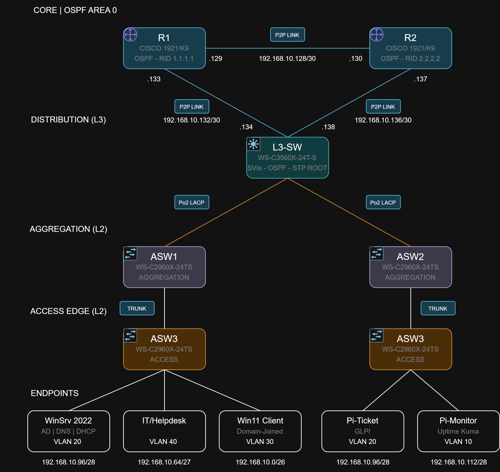

# Helpdesk + Network Lab

> A small-business network built on real Cisco hardware, with a Windows domain and
> helpdesk services running on top of it. Built while studying for the CCNA, aimed at
> a first IT support / helpdesk role.


What this project is: A small project to demostrate my understanding of both side of IT, the software and the networking.


<!-- ✍️ Replace with a screenshot of the rendered topology diagram -->

---

## What it demonstrates

**Networking**
- VLSM addressing from a single `192.168.10.0/24` block
- VLANs + 802.1Q trunking with a parked native VLAN
- EtherChannel (LACP) redundant uplinks
- Inter-VLAN routing on a Layer 3 switch (SVIs)
- OSPF (single area) across two routers and the L3 switch
- DHCP relay (`ip helper-address`) tying the network to the server

**Helpdesk / systems**
- Windows Server 2022: Active Directory, DNS, DHCP
- OUs, security groups, user accounts, a Group Policy Object
- Domain-joined Windows 11 client
- Ticketing / asset management (GLPI) and network monitoring (Uptime Kuma) on Raspberry Pi

---

## Hardware used

| Qty | Device | Role |
|-----|--------|------|
| 2 | Cisco 1921/K9 | OSPF core routers |
| 1 | WS-C3560X-24T-S | L3 switch — inter-VLAN routing, OSPF, STP root |
| 4 | WS-C2960X-24TS-L | Access switches |
| 4 | Raspberry Pi | Ticketing, monitoring, test client, spare |
| 1 | Host PC + VirtualBox | Windows Server 2022 + Windows 11 VMs |

---

## Repo layout

```
.
├── README.md
├── docs/
│   ├── 01-addressing-and-vlsm.md     # the VLSM exercise + answer key
│   ├── 02-configuration-reference.md # all device configs
│   ├── 03-helpdesk-setup.md          # AD / DNS / DHCP / GLPI / Kuma
│   ├── 04-troubleshooting-runbook.md # ticket-style troubleshooting log
│   └── 05-skills-demonstrated.md     # CV bullet points
├── diagrams/                         # screenshots + JSX source for the diagram/guide
└── configs/                          # exported running-configs per device
```

---

## Status

<!-- ✍️ Tick these off as you go -->
- [ ] Core routing (OSPF) up
- [ ] VLANs + EtherChannel up
- [ ] Inter-VLAN routing + DHCP relay working
- [ ] Windows Server 2022 (AD/DNS/DHCP) built
- [ ] Client domain-joined + GPO applied
- [ ] GLPI + Uptime Kuma running

## Notes
<!-- ✍️ FILL IN: anything that tripped you up and how you fixed it — recruiters love this -->
